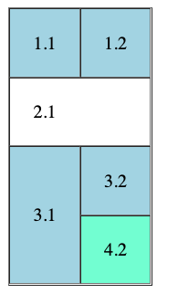

# Lenguajes de marcas: Subida de nota 1ª Ev

Examen práctico de la recuperación de la primera evaluación de _Lenguajes de marcas y sistemas de gestión de la información_
No mover los archivos de sitio.

## Contenidos:

- Tema 1: XML y JSON
- Tema 2: HTML
- Tema 3: CSS

## Enunciado

La prueba consta de 3 ejercicios. En el primero se pide hacer una conversión a .xml y a .json y en el seguno ejercicio se va a crear un sitio web compuesto de 3 páginas HTML y un fichero de estilos CSS.

### Ejercicio 1 (3 puntos)

Dada la estructura descrita más abajo, crear un archivo XML con dicha estructura y un archivo JSON. El XML se puede hacer con o sin atributos, a elección del alumno.

- empleado.xml(2pt)
- empleado.json(2pt)

**Estructura:**

Empleado:

- nombre: Mesi
- apellidos: Chiquito
- direccion:
  - calle: Uria 28
  - ciudad: Oviedo
- departamentos:
  - programación
  - diseño
  - análisis
- proyectos:
  - (nombre: pagina web, duracion: 20 horas)
  - (nombre: aplicación móvil, duracion: 27 horas)
  - (nombre: rediseño portfolio, duracion: 12 horas)

### Ejercicio 2 (5 puntos)

Este ejercicio está compuesto por varios archivos, se detalla a continuación lo que se pide para cada archivo

**- inicio.html (1,5pt)**

- un div con id `navegacion` con 3 enlaces en el siguiente orden: uno a inicio, otro a contacto y otro a tabla.
- h1 con tu nombre y apellidos
- Párrafo con breve descripción sobre ti
- h2 con el texto `Mis hobbies:`
- lista no numerada con 3 hobbies que te gusten
- h2 con texto `Mis series favoritas:`
- lista numerada con tus 3 series favoritas

**- contact.html(1,5pt)**

- un div con id `navegacion` con 3 enlaces en el siguiente orden: uno a inicio, otro a contacto y otro a tabla.
- h1 con el texto `Contacto`
- un formulario de contacto

En el formulario de contacto incluir los inputs para recopilar los siguientes datos:

- nombre
- email
- contraseña
- fecha nacimiento
- numero teléfono
- tipo de cliente:

  - empresa
  - particular
  - estudiante

- botón enviar

`Todos los inputs han de tener su correspondiente label, y los atributos id, name y type bien definidos`

**- tabla.html(1pt)**

- un div con id `navegacion` con 3 enlaces en el siguiente orden: uno a inicio, otro a contacto y otro a tabla.
- h1 con el texto `Tabla`
- Realizar la tabla reflejada en la siguiente imagen. (Los estilos se le tienen que dar en el fichero style.css)
- Darle a la última celda la clase `azul`

**- style.css(1pt)**

- Vincular todos los ficheros html a este fichero en el head.
- Hacer que los h1 tengan un tamaño de `48px`
- Hacer que las listas no numeradas sean de color `#777777`
- Hacer que los li de las listas numeradas tengan un paddin a la izquierda de `24px`
- El formulario ha de tener un ancho máximo de 300px y un padding de 12px
- Los inputs dentro del formulario han de ocupar el 100% de ancho.
- Hacer que las filas impares de la tabla tengan el color de fondo `lightblue`
- Hacer que los elementos con la clase `azul` tengan un color de fondo de color `aquamarine`

### Ejercicio 3 (2 puntos)

Selectores CSS: completar el css del archivo 3_selectores.html con los selectores que se indican en cada caso

## Entrega

Hacer commit con el mensaje `Entrega`, sincronizar los cambios y aceptar la creación de la bifurcación (fork) y subir también al campus virtual
